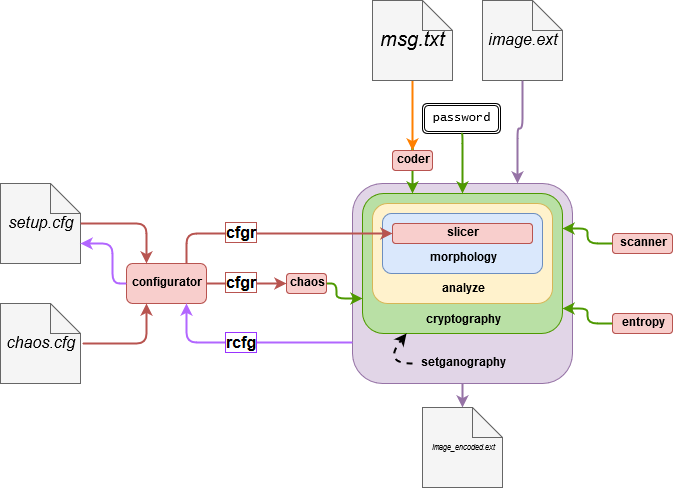

<h1 align="center"> ChaosKit </h1> <br>

## Table of Contents
- [About](#about)
- [Concept Flow](#concept-flow)
- [Usage](#usage)
- [Authors](#authors)
- [License](#license)
- [Feedback](#feedback)


## About
[](https://www.python.org/download/releases/2.7/)
[](https://pypi.python.org/pypi/opencv-python)
<br>
The Chaos Kit comprises of all the necessary python scripts for embedding information inside an image in a way that it goes unnoticed even with the Virtual Steganography Tool ([VSL](http://vsl.sourceforge.net/)).<br>
[Here](https://doi.org/10.1109/ICRCICN.2017.8234536) is the link to the IEEE publication based on the this work.

## Concept Flow
<p align="center"> &nbsp </p>

## Usage
  - Download all the file as zip from [here](../../releases/latest)
  - After install Python and running ```pip install opencv-python``` open ["<i>steganography.py</i>"](./steganography.py). <b>Dont run it now!</b>
  - Make a text file named "<i>msg.txt</i>" in the same directory and put your own message.  For [this particular image](./image.tiff?raw=true), the message file should be less than <b>8kb</b>. 
  - The default password is ```-1, 2.01, 3 ```. Refer to <i><b>line 127</b></i> and <i><b>line 230</b></i> of ["<i>steganography.py</i>"](./steganography.py) to embed and decipher respectively. 
  - All paswwords parameters are double-precision floating point resulting a <b>192 bits</b> key length.
  <br>Example password: ``` -3.12457863, 5.14785236997, 0.00012364478```
  - Now you can run the file and look for <b><i>image_encoded.tiff</i></b> file in the same directory.
  
## Authors
[](http://tamojitsaha.info)<br>
[](http://sandeepan.info)<br>
[]( http://github.com/thetdg)

## License
Contents of this repository are realeased under [CC-BY-NC-SA 4.0](./LICENSE.md) <br>
[](https://creativecommons.org/licenses/by-nc-sa/4.0/)

## Feedback
You can always open a [issue](https://github.com/TamojitSaha/ChaosKit/issues/new) if you find any bug.
